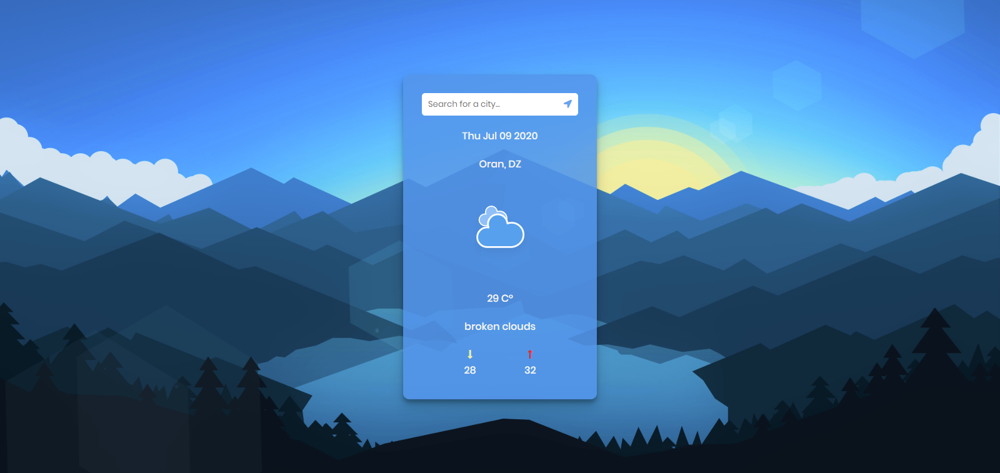

# Weather App

## Description:

Weather App that shows the local weather and also the city you search for.

## Tools & Languages:

- HTML5
- CSS3
- JavaScript ES6
- OpenWeatherMap API

## Screenshots:

### <a href="https://codedish.github.io/weather-app/">Live Demo</a>

## Fork

Anyone can improve upon this project and add other features, so feel free to fork.

## License

This project is open-source and under the <a href="https://opensource.org/licenses/MIT">MIT Licence</a>
